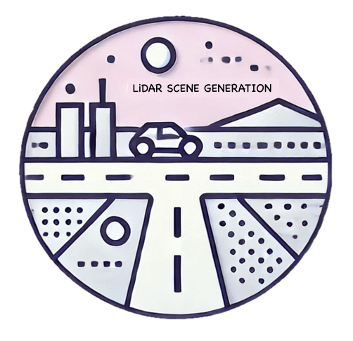
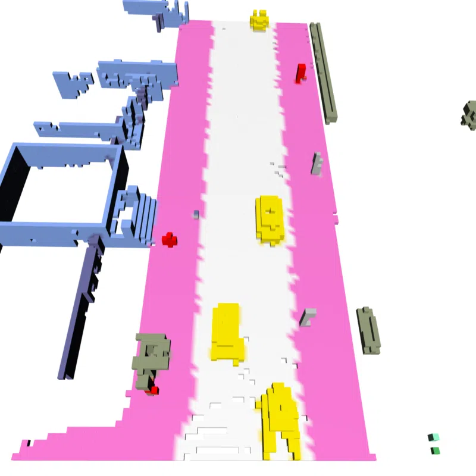
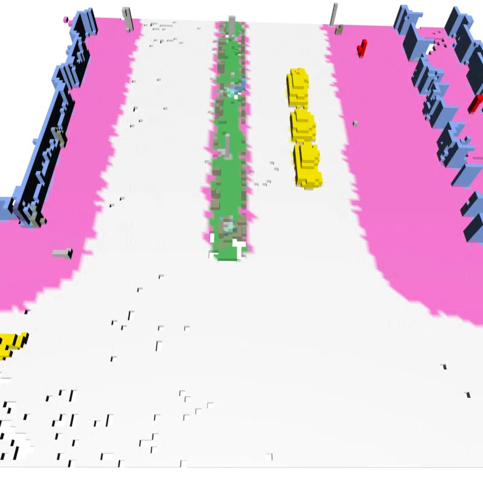
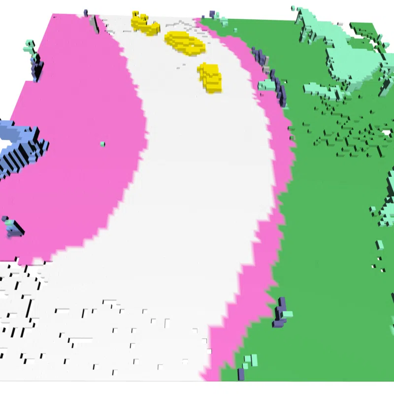
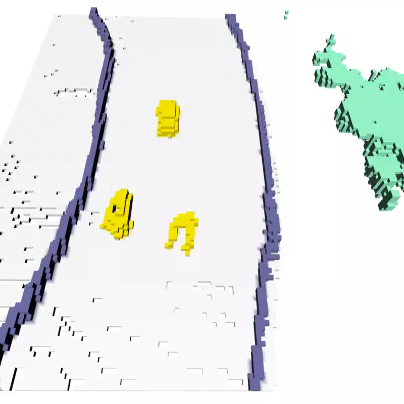
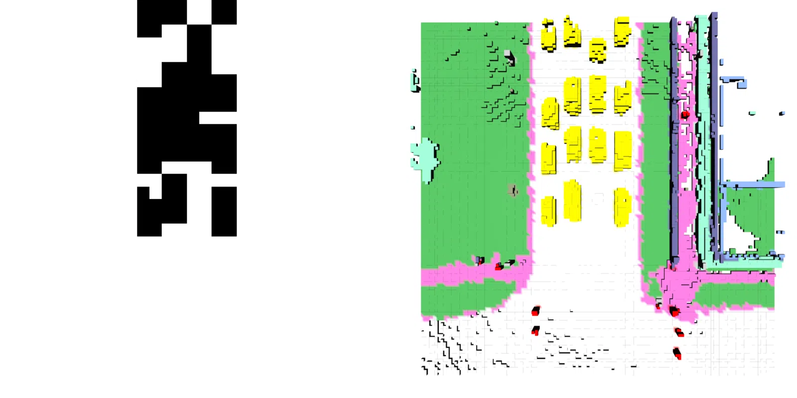
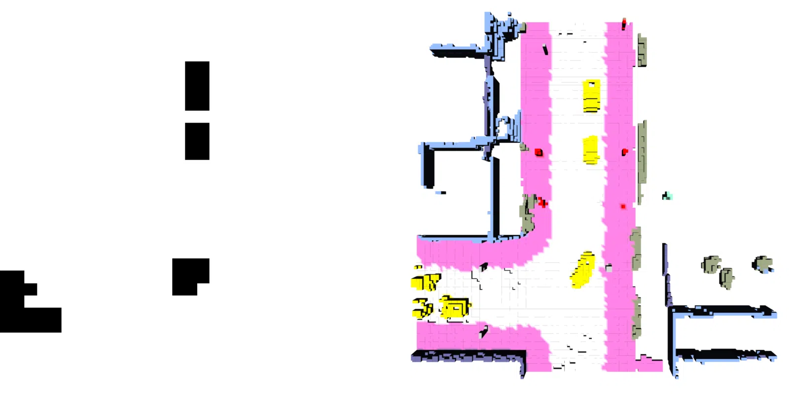

# DynamicCity: Large-Scale LiDAR Generation from Dynamic Scenes

||
|:-:|
|DynamicCity is a cutting-edge 4D LiDAR generation framework designed to capture the dynamic nature of real-world driving environments. It leverages a VAE model with a Projection Module and Expansion & Squeeze Strategy to efficiently represent and reconstruct large-scale LiDAR scenes, achieving up to 12.56 mIoU gain in fitting quality and 2.06x speedup in training. Additionally, a DiT-based diffusion model with a Padded Rollout Operation enables versatile applications like trajectory-driven, inpainting, and layout-conditioned generation. Extensive tests on CarlaSC and Waymo datasets show that DynamicCity significantly surpasses existing 4D LiDAR methods.|

## Updates

- **[October 2024]**: Project page released.

## Outline

- [Installation](#gear-installation)
- [Data Preparation](#hotsprings-data-preparation)
- [Getting Started](#rocket-getting-started)
- [Dynamic Scene Generation](#cityscape-dynamic-scene-generation)
- [TODO List](#memo-todo-list)
  

## :gear: Installation
Kindly refer to [INSTALL.md](docs/INSTALL.md) for the installation details.

## :hotsprings: Data Preparation
Kindly refer to [DATA_PREPARE.md](docs/INSTALL.md) for the details to prepare the [CarlaSC](), [Occ3D-Waymo](), and [Occ3D-nuScenes]() datasets.

## :rocket: Getting Started
Kindly refer to [GET_STARTED.md](docs/GET_STARTED.md) to learn more about how to use this codebase.

## :cityscape: Dynamic Scene Generation

### Unconditional Generation
||||
|-|-|-|
| |||
||||

### HexPlane Conditional Generation
||||
|-|-|-|
| |||
||||

### Command & Trajectory-Driven Generation
||||
|-|-|-|
| |||
||||

### Layout-Conditioned Generation
|||
|-|-|
| ||
|||

### Dynamic Scene Inpainting
|||
|-|-|
| ||
|||

## :memo: TODO List
- [ ] Release code
- [ ] Release model weights and pretrained checkpoints

